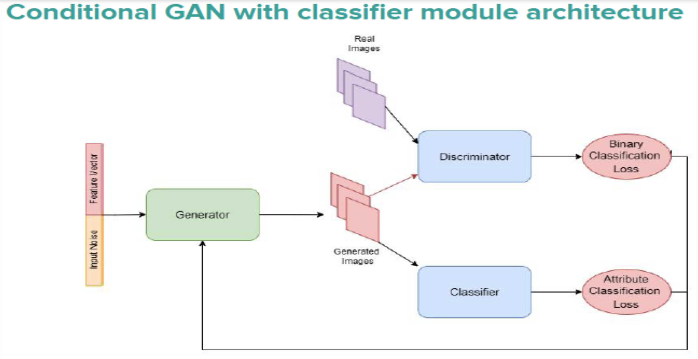

# Image-Translation-Problem-with-ModGAN
## <a href = "https://youtu.be/xmYkg3zay_g">Link</a> for the demo.
## Motivation & Problem Statement
* Face generation using GANs or Generative Adversarial Networks is highly random,
  as every forward pass generates an image from a randomly sampled noise vector.

* Most GANs focus only on the resolution aspect, without paying much attention 
  to facial attributes like skin color, hair color, etc.

* Thus we aim to control the generated output by providing auxiliary information 
  in the form of an attribute vector or a rough sketch.
  
* The assumption is that attributes will serve as a guiding signal to the generative 
  model and help it determine the corresponding output representation.

* The image translation problem, i.e. generation of realistic output images from 
  rough images or outlines has been explored for paired and unpaired image data.

## Pipeline


## How to run?
```
  1. Create the conda environment on your system using the 'environment.yml' file using the following command:
     'conda env create -f environment.yml'.
  2. Now, just activate this environment. Run 'inference_pipeline.ipynb' notebook for the demo.
```
